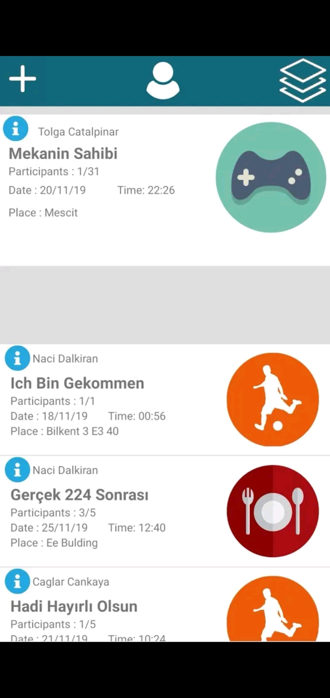
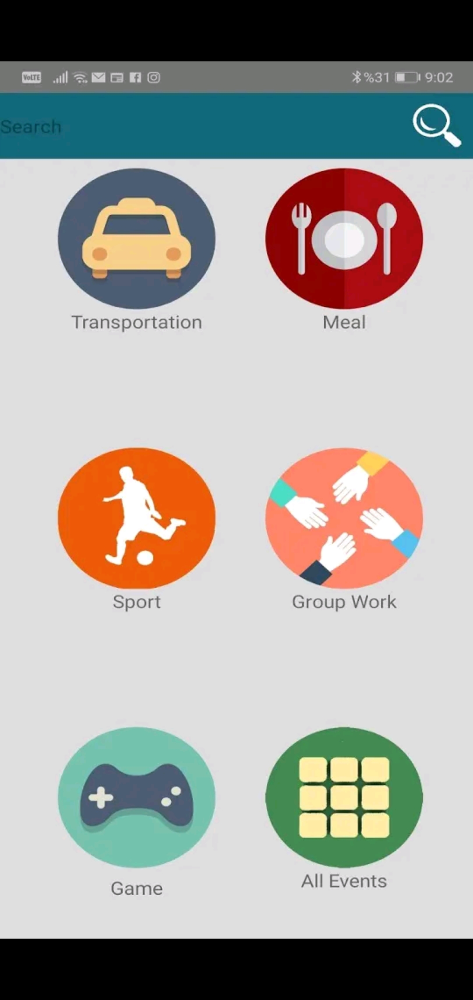
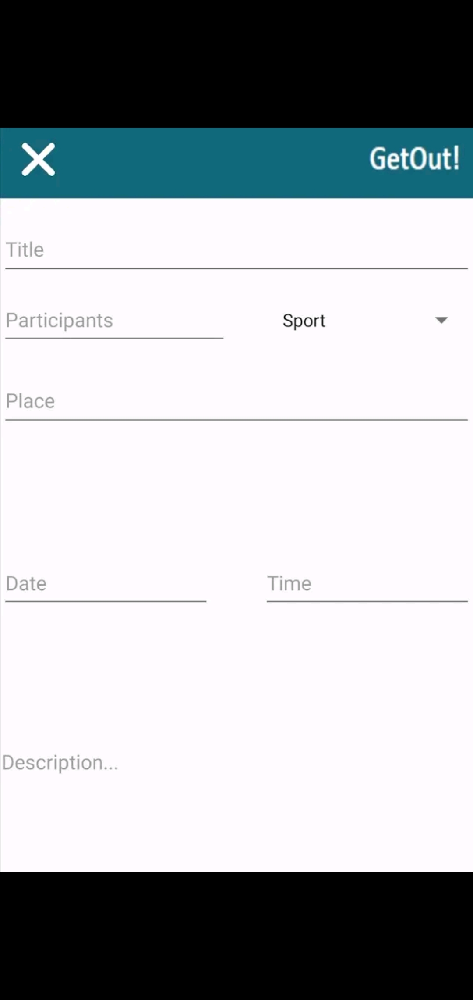
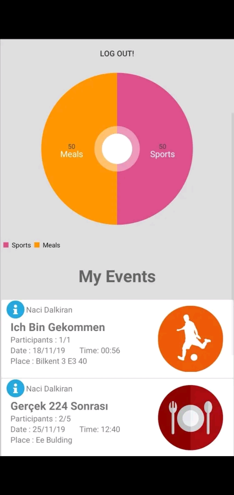
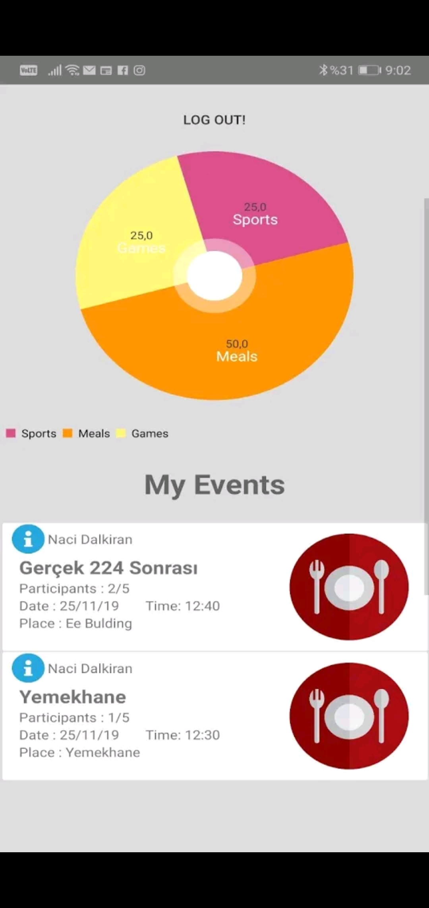
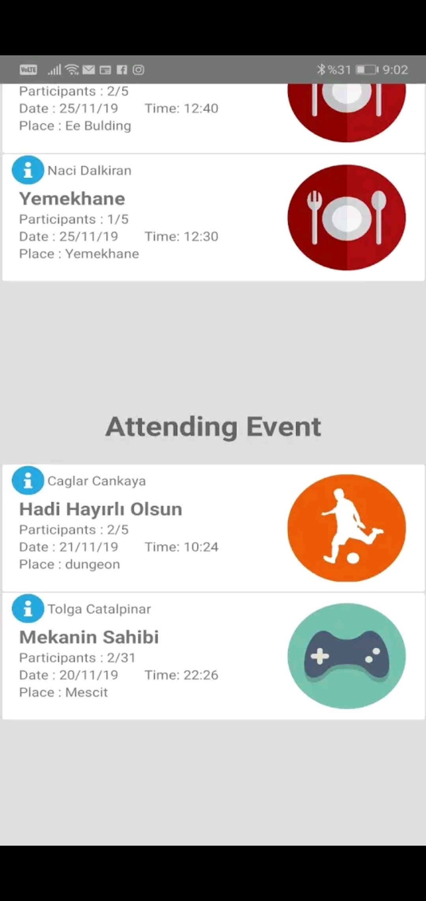

# CS102 - GetOut Project Team

Muhammed Naci Dalkiran,
Tolga Catalpinar, 
Caglar Cankaya,
Ali Taha Dincer,
Sena Korkut

# GetOut

   This application is for students at university who want to find other students to socialize
and save money. Users of this app, particularly students, can create an event in various
categories such as group work (studying, making models for projects etc.), sports (basketball,
football, tennis etc.), meals (ordering meals with someone to get a discount at different
restaurants), transportation (getting taxi with other people to pay less for transportation).
Having been created by students, events can be seen by other users of this application and
they can attend these events that have specific time-duration and place.

# Screenshots

# Main Screen

# Event Categories

# Creating An Event

# Profile of Users

